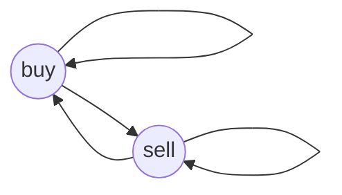

# [Best Time to Buy and Sell Stock with Transaction Fee](https://leetcode.com/problems/best-time-to-buy-and-sell-stock-with-transaction-fee/)

## 解题思路

利用有限状态机推出状态转移



buy[i] 为第 i 天买入时最大收益

sell[i] 为第 i 天卖出时最大收益

```python
buy[i] = max(sell[i - 1] - prices[i], buy[i - 1])
sell[i] = max(buy[i - 1] + prices[i] - fee, sell[i - 1])
```

由于每次都是只用到 buy[i - 1] 和 sell[i - 1] ，即上一次的值，所以可以进行优化。

```python
buy = max(pre_sell - prices[i], pre_buy)
sell = max(pre_buy + prices[i] - fee, pre_sell)
pre_buy = buy
pre_sell = sell
```
